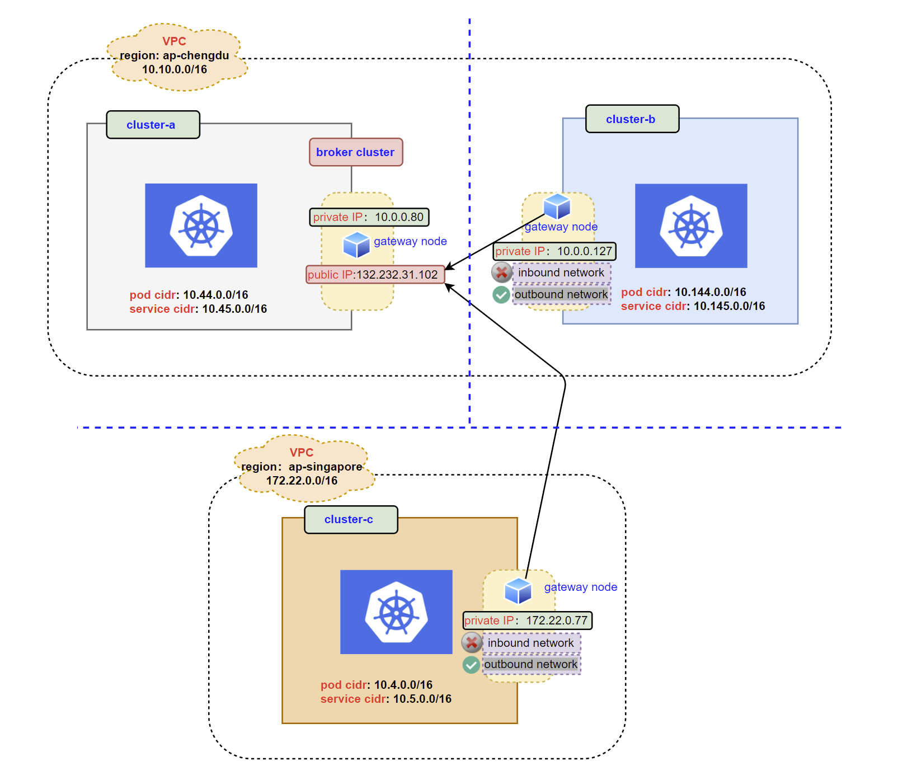

# 多集群通信方案设计文档

Kubernetes 实现了网络虚拟化，让容器可以在同一集群中的多个节点运行并相互通信。然而，在不同的 Kubernetes 集群中运行的容器并不能互相通信。一个集群的 Pod 不能直接访问立一个集群的 Servcie，为了实现不同集群 Pod <--> Pod， Pod --> Service 的访问，我们需要一种跨集群网络互通的解决方案。

## 设计目标

- 多集群之间 pod 与 pod 互通
- 多集群之间 pod 与 service 的连接
- 适配不同云厂商
- 适配常见的网络 CNI 插件
- 允许通过云原生的方式部署，创建自定义资源 CR 就可以快速在多集群之间部署

## 开源选择 Submariner

Submariner 是由 Rancher 开源的跨集群网络互通解决方案，通过创建了 IPSec 隧道和路径，使不同的 Kubernetes 集群中的容器能够直接连接。

主要功能：

- 与现有集群的兼容性和连接性：用户可以将 Submariner 部署到已有的 Kubernetes 集群中，并在位于不同集群的节点之间添加三层网络连接。
- 安全路径： 使用 IPSec 隧道实现加密的网络连接。
- 集中式代理 ：用户可以注册和维护一组健康的网关节点。通过 `Gateway` 组件实现
- 全局私有网络：使用全局虚拟网络解决多集群网络 overlapping CIDRs 的问题。通过 `Globalnet` 组件实现
- 服务发现： Submariner 提供跨多个 Kubernetes 集群的服务发现, 通过 `Lighthouse` 组件实现。
- CNI 兼容性： 适用于流行的 CNI 驱动程序。

## Operator 实现

通过 Operator 的形式部署 Submariner, operator 将会被部署在每个集群

- 部署 `broker`: 创建 `Knitnet` CR, 并配置 `brokerConfig`
- 部署 `join`: 创建 `Knitnet` CR, 并配置 `joinConfig`

### 架构

<div align="center">
    
</div>

### 功能

- 自动发现不同 Kubernetes 提供商 (aws, gcp)， 预先配置 Submariner 依赖端口
- 允许自定义安装 Submariner 相关组件，`Globalnet`, `Lighthouse`
- 适配现有常见的的网络 CNI 插件，如 generic, Canal, Weave-net, OpenshiftSDN, OVNKubernetes, Flannel 和 Calico。

### API 定义

此 Operator 只有一个 CRD `Knitnet`，Submariner 的 deploy，join，prepare cloud 都是通过一个 CR 完成，CR 当中主要包含3部分的配置：`brokerConfig`, `joinConfig` 和 `cloudPrepareConfig`。

```go
type KnitnetSpec struct {
	// INSERT ADDITIONAL SPEC FIELDS - desired state of cluster
	// Important: Run "make" to regenerate code after modifying this file

	// BrokerConfig represents the broker cluster configuration of the Submariner.
	// +optional
	BrokerConfig `json:"brokerConfig,omitempty"`

	// JoinConfig represents the managed cluster join configuration of the Submariner.
	// +optional
	JoinConfig `json:"joinConfig,omitempty"`

	// CloudPrepareConfig represents the prepare config for the cloud vendor.
	// +optional
	CloudPrepareConfig `json:"cloudPrepareConfig,omitempty"`
}
```

API定义：
```yaml
apiVersion: operator.tkestack.io/v1alpha1
kind: Knitnet
```

### 部署 Submariner broker, 创建下面的资源

```yaml
apiVersion: operator.tkestack.io/v1alpha1
kind: Knitnet
metadata:
  name: deploy-broker-sample
  namespace: default
spec:
  brokerConfig:
    defaultGlobalnetClusterSize: 65336
    globalnetCIDRRange: 242.0.0.0/16
    globalnetEnable: false
    serviceDiscoveryEnabled: true
```

当上面的资源创建成功后，会输出一个 `submariner-broker-info` 的 ConfigMap，这个 ConfigMap 信息主要是给其它集群加入 broker 用的。

### 添加集群到 Submariner Broker

添加集群需要部署2个资源，`submariner-broker-info` ConfigMap 和 join broker CR

`submariner-broker-info` 的信息在 broker 集群的 ConfigMap 中可以查到: `kubectl get cm submariner-broker-info -oyaml`

```yaml
apiVersion: v1
data:
  brokerInfo: xxx
kind: ConfigMap
metadata:
  labels:
    operator.tkestack.io/knitnet-name: join-broker-sample
    operator.tkestack.io/knitnet-namespace: default
  name: submariner-broker-info
  namespace: submariner-k8s-broker
```

Join broker CR, `clusterID` 目前是必须填写的，后面可以做到自动发现，其它选项都是可选的，如果没有自定义，默认值会被启用。

```yaml
apiVersion: operator.tkestack.io/v1alpha1
kind: Knitnet
metadata:
  name: join-broker-sample
  namespace: default
spec:
  joinConfig:
    clusterID: cls-mdl3wn46
    # forceUDPEncaps: false
    # globalnetClusterSize: 0
    # globalnetEnabled: true
    # healthCheckEnable: true
    # healthCheckInterval: 1
    # healthCheckMaxPacketLossCount: 5
    # ikePort: 500
    # ipsecDebug: false
    # labelGateway: true
    # loadBalancerEnabled: false
    # natTraversal: true
    # nattPort: 4500
    # preferredServer: false
    # submarinerDebug: false
  cloudPrepareConfig:
    credentialsSecret: xxx
    infraID: xxx
    region: xxx
    ## Only for aws cloud
    aws:
      gatewayInstance: m5n.large
      gateways: 1
```
